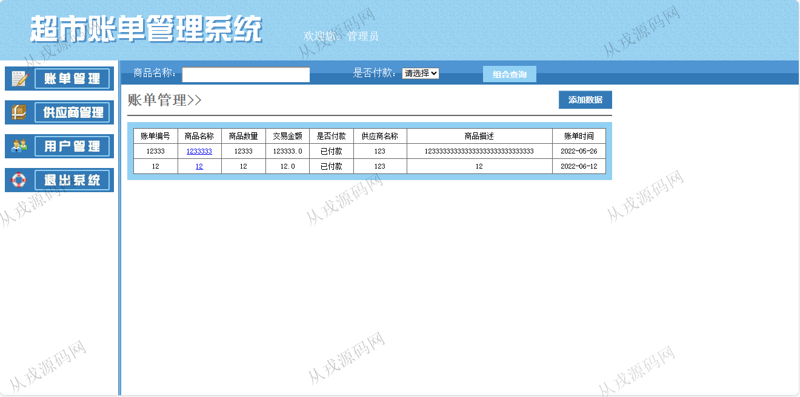
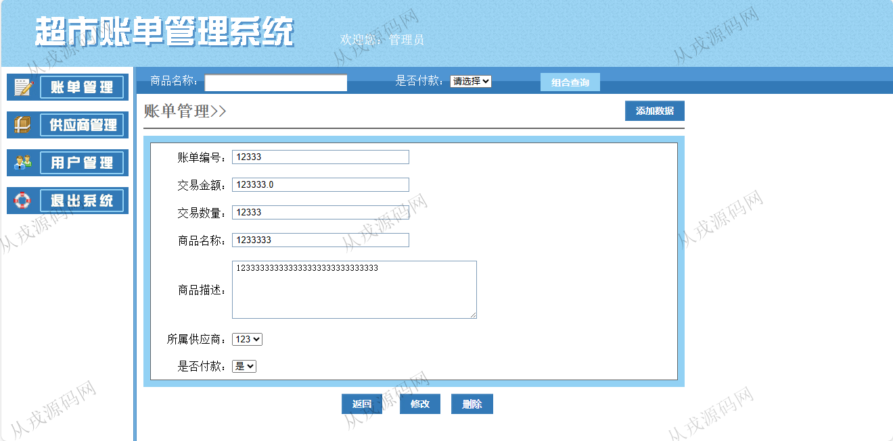
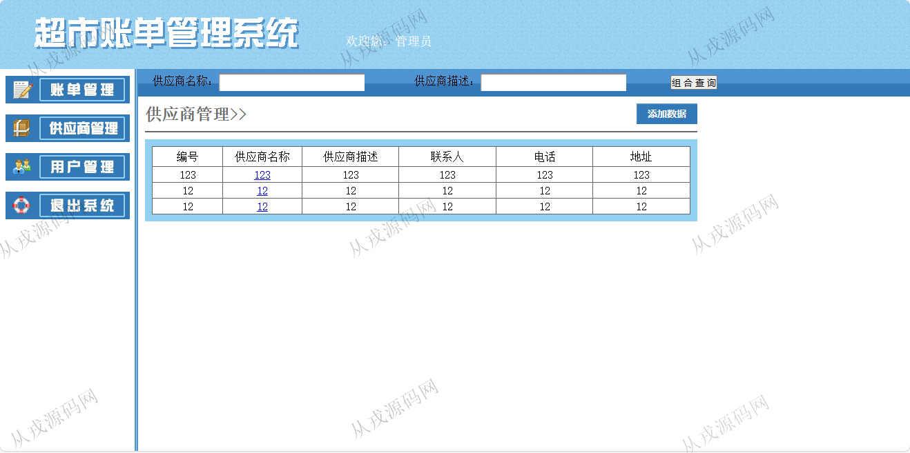
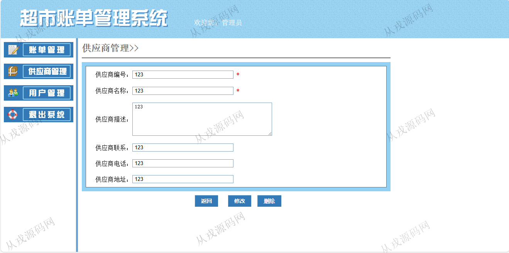
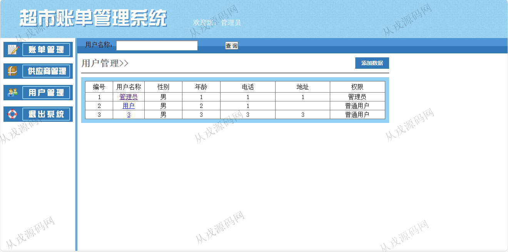
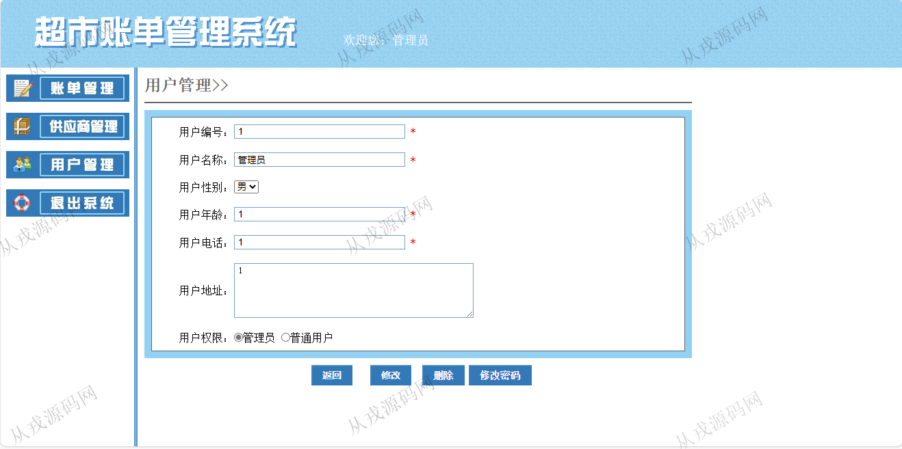
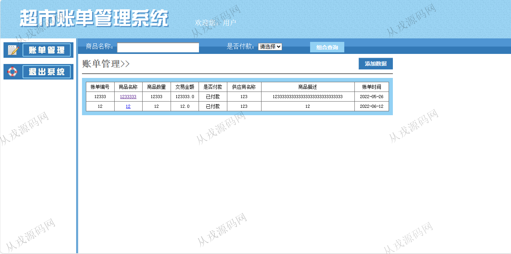

<h1 align="center">109.超市账单管理系统</h1>

- <b>完整代码获取地址：从戎源码网 ([https://armycodes.com/](https://armycodes.com/))</b>
- <b>技术探讨、资料分享，请加QQ群：692619798</b> 
- <b>作者微信：19941326836  QQ：952045282</b> 
- <b>承接计算机毕业设计、Java毕业设计、Python毕业设计、深度学习、机器学习</b>
- <b>选题+开题报告+任务书+程序定制+安装调试+论文+答辩ppt 一条龙服务</b>
- <b>所有选题地址 ([https://github.com/YuLin-Coder/AllProjectCatalog](https://github.com/YuLin-Coder/AllProjectCatalog)) </b>

## 项目介绍
基于jsp+servlet的超市账单管理系统：前端 jsp，后端 servlet，角色分为管理员、普通用户；集成账单管理、供应商管理、用户管理等功能于一体的系统。

## 功能介绍

基本功能：登录、退出
账单管理：账单列表查询，按商品名称搜索，按是否付款检索，添加账单数据，修改，删除
供应商管理：供应商列表查询，按名称搜索，按供应商描述搜索，添加供应商数据，修改，删除
用户管理：用户信息列表查询，按用户名称搜索，添加用户，查看详情，修改和删除

## 环境

- <b>IntelliJ IDEA 2021.3</b>

- <b>Mysql 5.7.26</b>

- <b>Tomcat 7.0.73</b>

- <b>JDK 1.8</b>

## 运行截图

